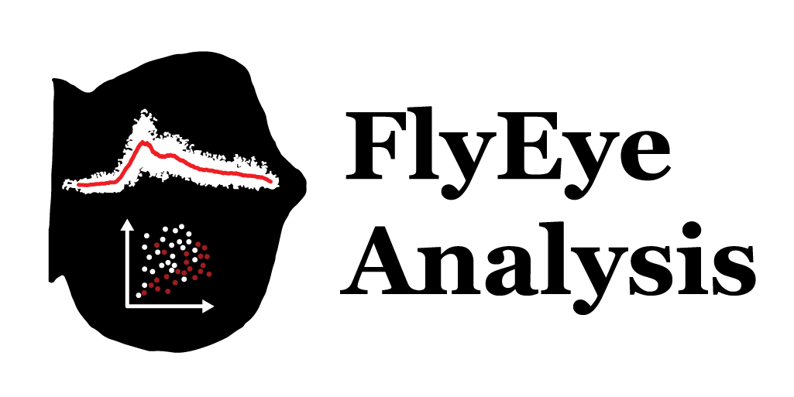

# 

**FlyEye Analysis** is part of the **NU FlyEye** platform for studying gene expression in *Drosophila* eye imaginal discs. The analysis package helps users analyze data measured using **FlyEye Silhouette**.

Given one or more ``.silhouette`` files, FlyEye Analysis facilitates:

   - **Dynamic Measurements.** Infer expression dynamics from static data

   - **Data Querying.** Select cells by developmental age and cell type

   - **Dynamic Analysis.** Analyze and visualize expression dynamics

   - **Spatial Analysis.** Detect and quantify spatial expression patterns

Please refer to the [documentation](https://sebastianbernasek.github.io/flyeye/index.html#) page for tips on getting started with analyzing your data.

Dependencies
============

 - Python 3.6+

Required:

 - [Scipy](https://www.scipy.org/)
 - [Pandas](https://pandas.pydata.org/)
 - [Matplotlib](https://matplotlib.org/)
 - [AstroML](https://pypi.org/project/astroML/)
 - [AstroML Addons](https://github.com/astroML/astroML_addons)

Installation
============

The simplest method is to install via ``pip``:

    pip install flyeye

Examples
========

For an example of a complete project utilizing the entire **NU FlyEye** platform, please refer to [our study](https://github.com/sebastianbernasek/pnt_yan_ratio) of Pointed and Yan expression during retinal patterning.

Authors
=======

[Amaral Lab](https://amaral.northwestern.edu/)
