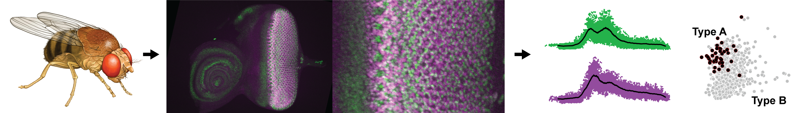

.. image:: graphics/Northwestern_purple_RGB.png
   :width: 30%
   :align: right
   :alt: nulogo

===================
NU FlyEye: Analysis
===================

**NU FlyEye:** *Analysis* is part of the **NU FlyEye** platform for studying gene expression in the developing *Drosophila* eye. The *Analysis* package provides methods for analyzing expression data measured *in vivo* using the **NU FlyEye:** *Silhouette* package for macOS.

Given one or more ``.silhouette`` files, **NU FlyEye:** *Analysis* facilitates:

   - **Time Series Construction:** converting static measurements to developmental timepoints
   - **Data Management:** querying samples by developmental time, cell type, and experimental condition
   - **Dynamic Analysis:** analysis and visualization of expression dynamics
   - **Spatial Analysis:** analysis and visualization of spatial expression patterns

The initial release is primarily limited to basic tools required to replicate `our study <https://github.com/sebastianbernasek/pnt_yan_ratio>`_ of Pnt and Yan expression during retinal patterning in *Drosophila*. We intend to expand this functionality in later releases.

.. toctree::
   :hidden:
   :maxdepth: 2

   INSTALLATION <installation>
   API DOCUMENTATION <documentation>
   GETTING STARTED <start>
   EXAMPLE USAGE <usage>
   CONTACT US <contact>
