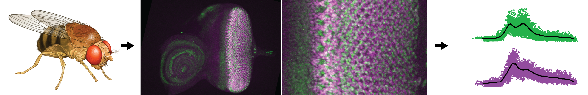

.. image:: graphics/Northwestern_purple_RGB.png
   :width: 30%
   :align: right
   :alt: nulogo

===============
FlyEye Analysis
===============

**FlyEye Analysis** is part of the **NU FlyEye** platform for studying gene expression in *Drosophila* eye imaginal discs. The analysis package helps users analyze data measured using **FlyEye Silhouette**.

Given one or more ``.silhouette`` files, FlyEye Analysis facilitates:

   - **Dynamic Measurements.** Infer expression dynamics from static data

   - **Data Querying.** Select cells by developmental age and cell type

   - **Dynamic Analysis.** Analyze and visualize expression dynamics

   - **Spatial Analysis.** Detect and quantify spatial expression patterns

Please refer to the [documentation](https://sebastianbernasek.github.io/flyeye/index.html#) page for tips on getting started with analyzing your data.

.. toctree::
   :hidden:
   :maxdepth: 2

   INSTALLATION <installation>
   GETTING STARTED <start>
   DOCUMENTATION <documentation>
   EXAMPLE USAGE <usage>
   CONTACT <contact>
